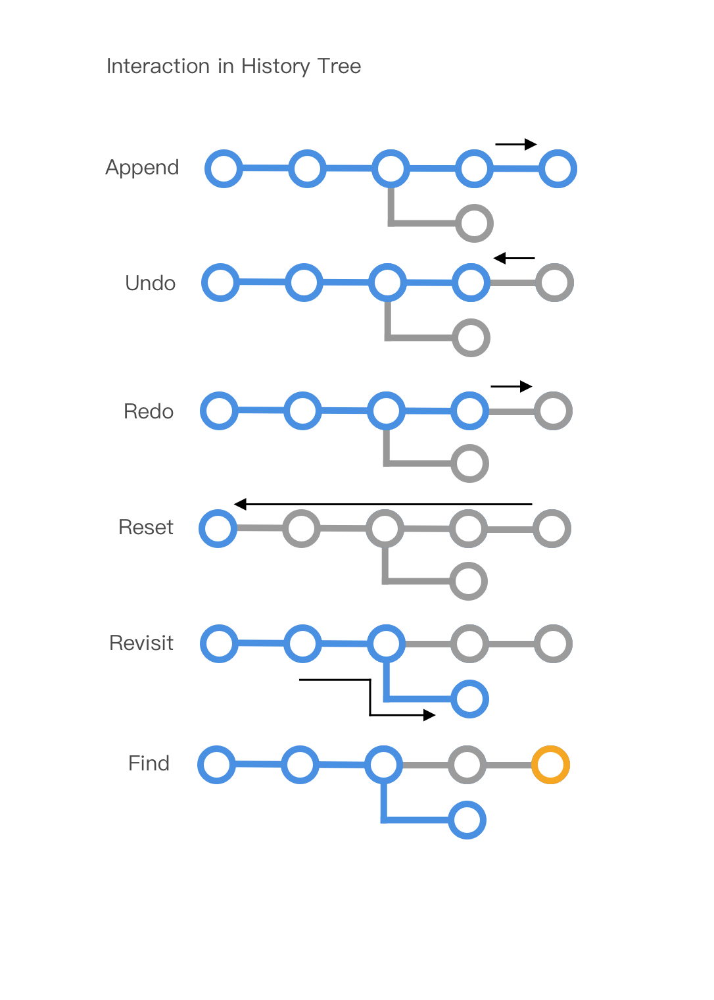

# history-tree

An interactive history tree for undo/redo/reset/revisit in javascript. [demo Link](https://sdq.github.io/history-tree)


Interaction design 
------


Installation
------
```
<script src="https://sdq.ai/history-tree/history-tree.js"></script>
```

Use history-tree structure
------
```
var tree = historyTree();
tree.append(state);
tree.undo();
tree.redo();
tree.reset();
tree.revisit(id);
tree.find(id);
tree.log(chart.export());
```

Use history-tree-view
------
```
var chart = historyTreeView();
chart.container("#your-container-id");
chart.append(state);
chart.undo();
chart.redo();
chart.reset();
chart.revisit(id);
chart.find(id);
console.log(chart.export());
```

Author
------
[sdq](http://shidanqing.net)


License
-------
[MIT](https://opensource.org/licenses/MIT)


